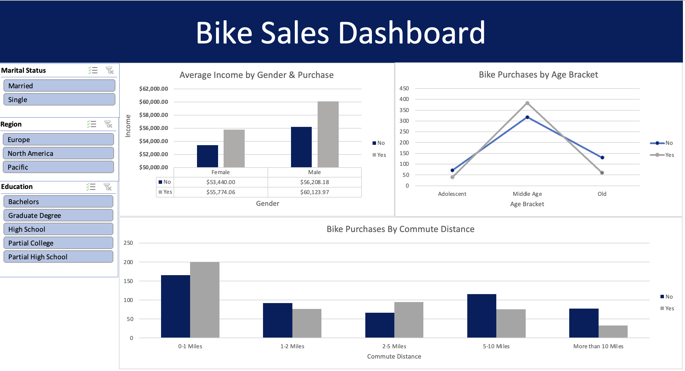
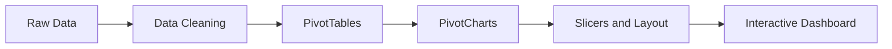
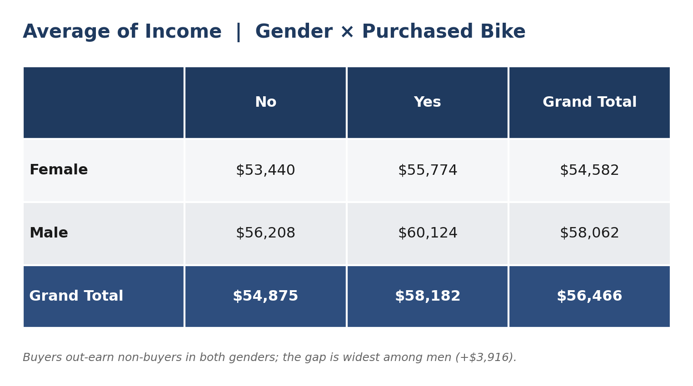
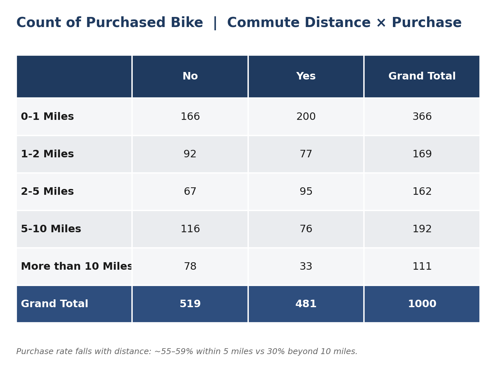
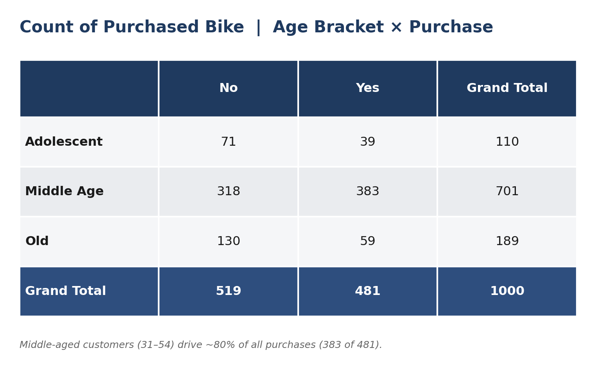

# Bike Sales Dashboard — Excel Data Analysis

An interactive Excel dashboard that analyzes what drives bike purchases — examining income, gender, age, commute distance, and other demographics — built end to end, from raw data cleaning through modeling to an interactive, slicer-driven dashboard.

<p align="center">
  
</p>

---

## Project Overview

A retailer wants to understand its potential bike-buying customers. Using a survey-style dataset of 1,000 individuals, this project answers a core business question:

**Which customer characteristics are most associated with buying a bike, and where should marketing focus?**

Of the 1,000 respondents, **48.1% purchased a bike** — a near-even split that makes the differences between buyers and non-buyers especially meaningful. The final deliverable is an interactive Excel dashboard that lets a user slice the data by marital status, region, and education, and instantly see how income, age, and commute distance relate to purchase behavior.

---

## Dataset

The dataset contains one row per respondent with the following fields:

| Field | Description |
|---|---|
| ID | Unique respondent identifier |
| Marital Status | Married / Single |
| Gender | Male / Female |
| Income | Annual income |
| Children | Number of children |
| Education | Highest education level |
| Occupation | Occupation category |
| Home Owner | Yes / No |
| Cars | Number of cars owned |
| Commute Distance | Distance from home to work (banded) |
| Region | Geographic region |
| Age | Respondent age |
| Purchased Bike | Target variable — Yes / No |

---

## Tools and Skills

Microsoft Excel, using:

- Data cleaning — Remove Duplicates, Find and Replace, number and currency formatting
- Feature engineering — nested `IF` formula to create age brackets
- PivotTables — aggregating and summarizing across dimensions
- PivotCharts — clustered column and line visualizations
- Slicers — interactive cross-filtering across all charts
- Dashboard design — layout, alignment, and color theming

---

## Workflow



### 1. Data Cleaning

Worked on a copy of the raw data, keeping the original untouched on a separate sheet for safety, and prepared it for analysis:

- Removed duplicate records (1,026 raw rows reduced to 1,000 unique respondents) to prevent double-counting.
- Standardized coded values for readability — replaced `M`/`S` with `Married`/`Single` and `M`/`F` with `Male`/`Female` so the dashboard is understandable to a non-technical audience.
- Formatted income as currency for consistent, clean display.
- Reworded the commute band `10+ Miles` to `More than 10 Miles` so categories sort in a logical order.

### 2. Feature Engineering

Created an Age Brackets column using a nested `IF` formula to group individual ages into three readable segments:

```excel
=IF(Age<31,"Adolescent",IF(Age<55,"Middle Age","Old"))
```

Bucketing continuous age into brackets makes the age analysis far easier to read than plotting dozens of individual ages.

### 3. Data Modeling (PivotTables)

Built PivotTables to summarize the full 1,000-respondent dataset for each view. Each table feeds a matching PivotChart on the dashboard.

**Average income by gender, split by purchase decision**

<p align="center">
  
</p>

**Count of purchases by commute distance**

<p align="center">
  
</p>

**Count of purchases by age bracket**

<p align="center">
  
</p>

### 4. Visualization (PivotCharts)

- Average Income by Gender and Purchase — clustered column chart
- Bike Purchases by Age Bracket — line chart showing the shape across ordered age groups
- Bike Purchases by Commute Distance — clustered column chart across distance bands

### 5. Dashboard Assembly

- Arranged charts on a dedicated dashboard sheet, removed gridlines, and added a title banner.
- Added three slicers — Marital Status, Region, and Education — and connected them to all PivotTables through Report Connections so every chart filters together in real time.
- Applied a consistent navy and grey color theme for a clean, professional look.

---

## Key Insights

- **Buyers earn more.** In both genders, people who purchased a bike had a higher average income than those who did not. The gap is widest among men, where buyers averaged about $60,100 versus $56,200 for non-buyers — suggesting income is a meaningful purchase driver.
- **Middle-aged customers dominate.** Respondents aged 31 to 54 accounted for 383 of the 481 purchases (roughly 80%), far outpacing adolescents and older customers.
- **Purchase rate falls as commute distance grows.** Short commuters buy at the highest rates — around 55–59% for those within 5 miles of work — dropping to 40% at 5–10 miles and just 30% for commutes over 10 miles. (Note this is a rate, not a raw count: the 0–1 mile band has the most buyers simply because most respondents live close to work.)
- **Income skews by gender** in this sample, with males reporting higher average income than females across both buyer and non-buyer groups.

---

## Business Recommendations

- Prioritize the middle-aged, higher-income segment in paid marketing, where the large majority of purchases concentrate.
- Target short-commute and urban customers, who convert at meaningfully higher rates, with commuter-focused messaging.
- Test premium positioning, since buyers consistently earn more than non-buyers, indicating potential room to move up-market.
